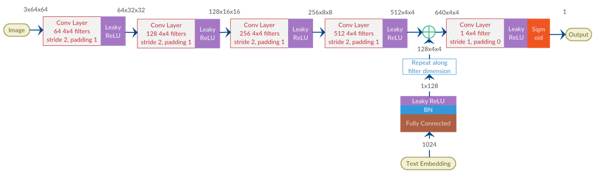
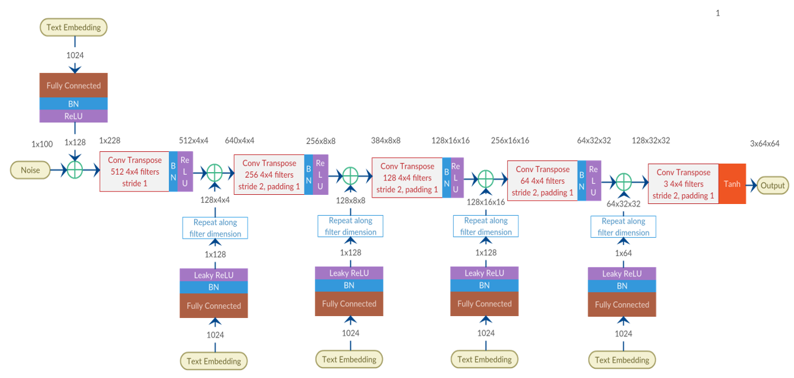
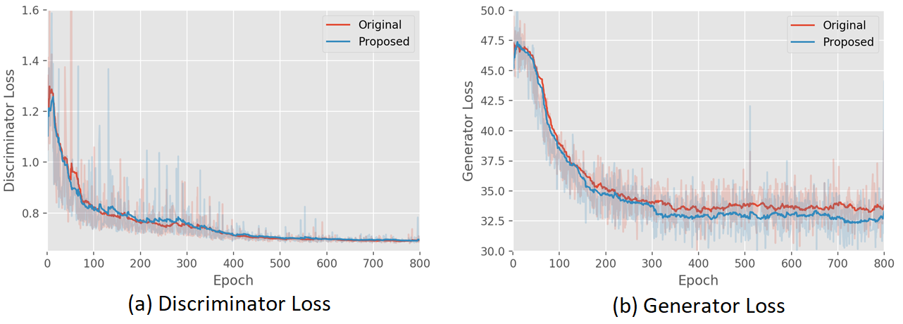
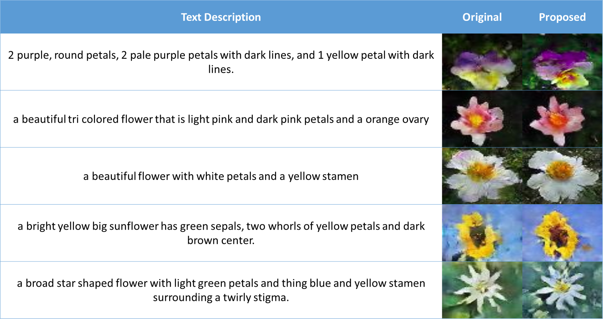
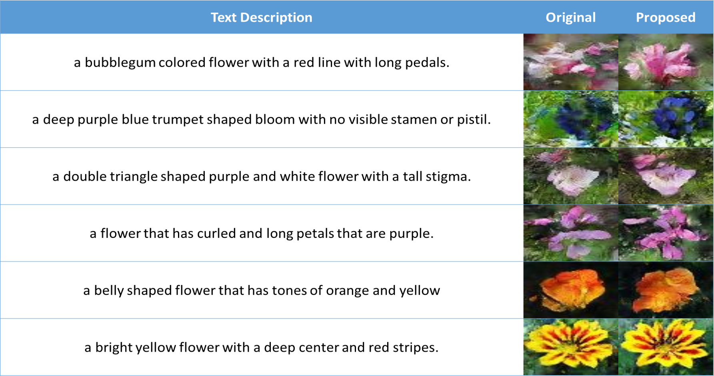
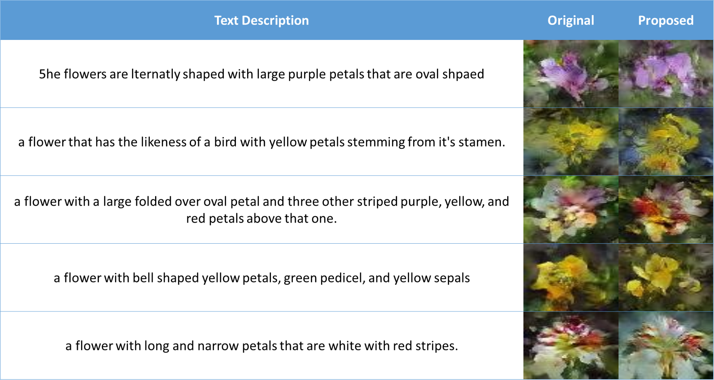
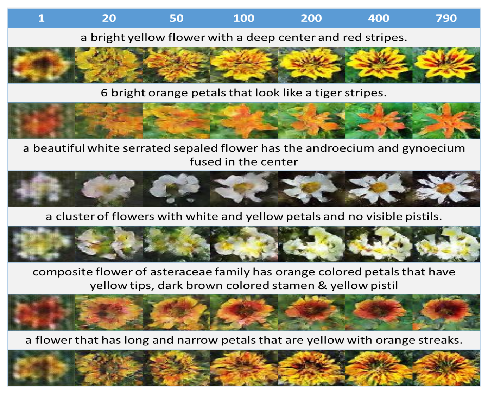

# ResGAN: Image Synthesis from Text Description
By Naman Sharma, An Lijun, Zhang Miaolin

This work aims to solve the problem of image synthesis from text descriptions. The trained GAN model accepts text descriptions of an object and tries to generate images based on that text description. This work is based on top of a similar work done by Scott Read in his article [Generative Adversarial Text-to-Image Synthesis](https://arxiv.org/abs/1605.05396), implemented at his [Github repository](https://github.com/reedscot/icml2016). His implementation referred to as the "original" from now on.

## Proposed Architecture
Given that text description can contain details which can be useful on different layers of the network, we propose injecting repeated instances of the text description throughout the network. For example, color may be useful in the lower layers while textures may be useful in higher layers. The generative and discriminative architectures are given below.

Discriminator Architecture: Same as the original architecture

Generator Architecture: With text embeddings injected at different layers

Based on the above architecture, we can see that we are able to achieve a lower loss on the generator because of the injected text embeddings.

## Example images

We also show how the quality of the images change based on the number of epochs for which the network is trained.

## Training the network
Follow these steps to get the datasets and train the network:
1. Download the [birds]() and [flowers]() and [COCO]() captions
2. Download the [birds]() and [flowers]() and [COCO]() images
3. Download the text encoders for [birds]() and [flowers]() and [COCO]() descriptions
4. Put the downloaded datasets into the `./data` folder
5. Run `trainer.py`. Once the data is trained, you can see the results in the folder `./results`